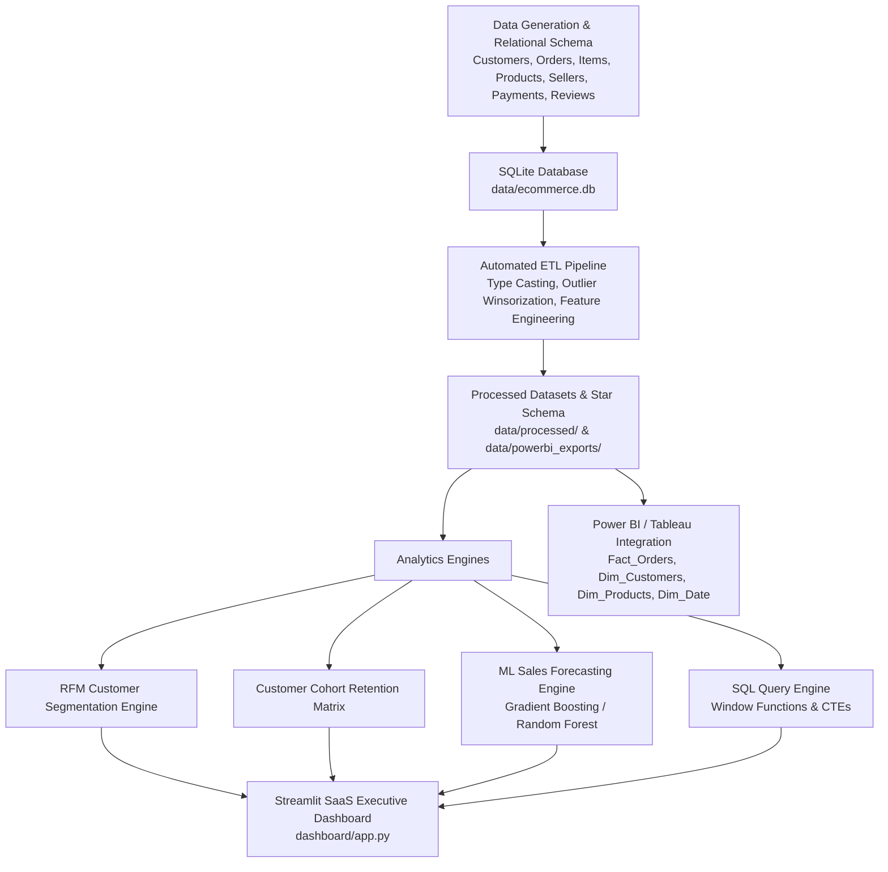

# End-to-End E-Commerce Sales Analytics & SaaS Executive Platform

[](https://apex-analytics-dashboard.streamlit.app/)
[](https://www.python.org/)
[](https://streamlit.io/)
[](https://plotly.com/)
[](https://www.sqlite.org/)
[](https://powerbi.microsoft.com/)
[](https://scikit-learn.org/)
[](LICENSE)

> A **production-grade, enterprise SaaS E-Commerce Sales Analytics Platform & Executive Dashboard** designed to deliver data-driven business insights, RFM customer segmentation, SQL analytics, cohort retention matrices, and machine learning sales forecasting.

🌐 **Live Web Application**: [https://apex-analytics-dashboard.streamlit.app/](https://apex-analytics-dashboard.streamlit.app/)

---

## 📌 Executive Overview

In modern e-commerce operations, executives and category managers require real-time visibility into revenue velocity, customer retention, fulfillment SLAs, and inventory health. 

This platform processes a **3-year multi-table relational dataset (~22,000+ orders across 8 relational tables)** to compute key executive KPIs, perform customer RFM segmentation, uncover shipping bottlenecks, run live SQL queries, and project 30–90 day revenue trajectories using supervised machine learning algorithms.

Designed with a **dark-mode glassmorphism aesthetic**, the platform mimics enterprise SaaS solutions like Microsoft Power BI, Tableau, and Datadog.

---

## 🏗️ Technical Architecture & Workflow



---

## ✨ Key Features & Dashboard Modules

### 1. 📊 Executive KPI Overview
* **Financial & Growth Indicators**: Real-time tracking of Net Revenue, Total Orders, Active Customers, Net Profit Margin %, Average Order Value (AOV), Repeat Customer Rate, and Cancellation Rates.
* **Interactive Revenue Velocity Chart**: Plotly line chart with 7-day moving averages and MoM growth indicators.
* **Hierarchical Category Treemap & US Regional Map**: Visualizing revenue volume across departments and state-level geographic performance.

### 2. 📈 Sales & Payment Analytics
* **Seasonality Heatmaps**: Hourly and day-of-week purchasing patterns across all 12 calendar months.
* **Payment Method Breakdown**: Volume distribution across Credit Card, PayPal, Debit Card, UPI, and Buy Now Pay Later (BNPL).
* **Shipping SLA & Delivery Delays**: Delivery lead time box plots by US state correlated with customer review star ratings.

### 3. 👥 Customer RFM Analytics & Cohort Retention
* **Recency, Frequency, Monetary (RFM) Segmentation**: Customer classification into *Champions, Loyal Customers, Potential Loyalists, At Risk, Hibernating, and Lost*.
* **Cohort Retention Matrix**: Pivot grid tracking monthly customer acquisition cohorts and retention percentage decay over time.
* **High-Value Customer Leaderboard**: Ranked table of top customers by total lifetime spend and predicted Customer Lifetime Value (CLV).

### 4. 📦 Product & Inventory Intelligence
* **Top Winners & Profitability Matrix**: Best-selling products by volume and net margin ($).
* **Slow-Moving / Overstocked Alerts**: Automated flag identifying products with high stock (>120 units) but low 90-day sales velocity to release working capital.

### 5. 💻 Interactive Live SQL Studio
* **SQL Query Repository**: 6 pre-built production SQL scripts utilizing CTEs, `LAG()`, `NTILE()`, and `DENSE_RANK()` window functions.
* **Live Query Console**: Interactive query editor allowing users to execute custom SQL directly against `ecommerce.db` with one-click CSV downloads for Power BI.

### 6. 🤖 ML Sales & Demand Forecasting
* **Time-Series Supervised Learning**: Machine learning models (Gradient Boosting, Random Forest, Ridge) trained on daily historical sales, calendar features, and rolling lag statistics.
* **Interactive Forecast Horizon**: 30 to 90-day future daily revenue projections with 95% confidence bands and holdout test metrics ($RMSE, MAE, MAPE, R^2$).

### 7. 💡 Strategic Business Insights
* **C-Suite Briefing Cards**: Structured actionable recommendations across customer retention, shipping logistics SLAs, pricing strategy, and payment gateway expansion.

---

## 📂 Project Directory Structure

```
E-Commerce Dashboard/
│
├── data/                       # SQLite DB, Processed CSVs & Power BI Star-Schema exports
│   ├── ecommerce.db
│   ├── processed/
│   └── powerbi_exports/
│       ├── Fact_Orders.csv
│       ├── Dim_Customers.csv
│       ├── Dim_Products.csv
│       ├── Dim_Sellers.csv
│       ├── Dim_Date.csv
│       └── PowerBI_Ecommerce_StarSchema.xlsx
│
├── sql/                        # Repository of Production SQL Queries
│   ├── 01_kpi_overview.sql
│   ├── 02_customer_analytics.sql
│   ├── 03_product_performance.sql
│   ├── 04_sales_trends.sql
│   ├── 05_cohort_analysis.sql
│   └── 06_regional_and_shipping.sql
│
├── utils/                      # Modular Python Analytics Engines
│   ├── __init__.py
│   ├── data_generator.py       # Multi-table synthetic data generator
│   ├── db_manager.py           # SQLite Schema & View Initializer
│   ├── etl_pipeline.py         # ETL Data Cleaning & Feature Engineering
│   ├── rfm_analytics.py        # RFM Segmentation & Cohort Matrix Engine
│   ├── forecasting_engine.py   # Machine Learning Time-Series Forecaster
│   ├── powerbi_exporter.py     # Star-Schema Exporter for Power BI / Tableau
│   └── sql_runner.py           # SQL Query Execution Utility
│
├── dashboard/                  # Streamlit Multi-Page Executive App
│   ├── app.py                  # Main App Entry & Sidebar Navigation
│   ├── styles.css              # Dark Mode & Glassmorphic Custom Styling
│   ├── components/             # Reusable UI Cards & Plotly Charts
│   └── views/                  # 7 Interactive View Modules
│
├── notebooks/                  # Standalone Jupyter Notebooks for EDA & ML
│   ├── 01_data_cleaning_eda.ipynb
│   ├── 02_sql_analytics_deepdive.ipynb
│   └── 03_ml_forecasting_models.ipynb
│
├── models/                     # Serialized Machine Learning Forecaster Artifacts
├── requirements.txt            # Python Dependencies
├── seed_data.py                # Pipeline Trigger Script
└── README.md                   # Project Documentation
```

---

## 🛠️ Quickstart Installation & Setup

### 1. Clone Repository & Setup Virtual Environment
```bash
git clone https://github.com/your-username/ecommerce-sales-analytics.git
cd ecommerce-sales-analytics

# Create virtual environment
python -m venv venv
# Activate on Windows:
venv\Scripts\activate
# Activate on Mac/Linux:
source venv/bin/activate
```

### 2. Install Required Dependencies
```bash
pip install -r requirements.txt
```

### 3. Run Pipeline to Build Database & Train Models
```bash
python seed_data.py
```

### 4. Launch Streamlit SaaS Dashboard
```bash
streamlit run dashboard/app.py
```
*Access dashboard in your web browser at `http://localhost:8501`*

---

## 💻 SQL Query Highlights

### Customer Lifetime Value & RFM Segmentation (`sql/02_customer_analytics.sql`)
```sql
WITH CustomerAggregates AS (
    SELECT 
        c.customer_id,
        c.first_name || ' ' || c.last_name AS customer_name,
        COUNT(DISTINCT o.order_id) AS total_orders,
        COALESCE(SUM((oi.unit_price - oi.discount_amount) * oi.quantity), 0) AS total_lifetime_spend,
        MAX(o.order_date) AS last_order_date
    FROM customers c
    JOIN orders o ON c.customer_id = o.customer_id
    JOIN order_items oi ON o.order_id = oi.order_id
    WHERE o.order_status != 'Cancelled'
    GROUP BY c.customer_id
)
SELECT 
    customer_id,
    customer_name,
    total_orders,
    ROUND(total_lifetime_spend, 2) AS total_lifetime_spend,
    NTILE(5) OVER (ORDER BY last_order_date ASC) AS r_score,
    NTILE(5) OVER (ORDER BY total_orders ASC) AS f_score,
    NTILE(5) OVER (ORDER BY total_lifetime_spend ASC) AS m_score
FROM CustomerAggregates
ORDER BY total_lifetime_spend DESC
LIMIT 100;
```

---

## 📊 Power BI & Tableau Compatibility

The platform automatically exports a relational **Star-Schema** into `data/powerbi_exports/`:
1. **`Fact_Orders`**: Granular transactional order items with sales, discounts, freight, and net item profit.
2. **`Dim_Customers`**: Demographics, RFM segments, and predicted CLV metrics.
3. **`Dim_Products`**: Category hierarchy, unit costs, list prices, and stock levels.
4. **`Dim_Sellers`**: Seller ratings, locations, and order fulfillment counts.
5. **`Dim_Date`**: Date key, year, quarter, month name, fiscal period, and weekend flags.

To import into Power BI Desktop:
* Open Power BI -> **Get Data** -> **Folder / Excel Workbook** -> Select `data/powerbi_exports/PowerBI_Ecommerce_StarSchema.xlsx`.

---

## 📄 Resume-Ready Project Description

```markdown
**End-to-End E-Commerce Sales Analytics & SaaS Platform | Python, SQL, Streamlit, ML, Power BI**
- Architected an enterprise-grade SaaS analytics dashboard processing 22,000+ orders across an 8-table relational SQLite database.
- Automated ETL pipeline featuring outlier winsorization, missing value imputation, and feature engineering for delivery lead times and profit margins.
- Developed RFM customer segmentation engine classifying 3,500+ users into loyalty cohorts and calculated monthly acquisition retention matrices.
- Built supervised machine learning sales forecasting models (Gradient Boosting / Random Forest) generating 30-90 day revenue predictions with 95% confidence bounds.
- Created 6 production SQL scripts utilizing CTEs, NTILE, DENSE_RANK, and LAG window functions to analyze MoM growth trends and inventory health.
- Exported clean Star-Schema data model (Fact_Orders, Dim_Customers, Dim_Products, Dim_Date) for Power BI & Tableau dashboards.
```

---

## 📜 License
Distributed under the MIT License. See `LICENSE` for more details.
